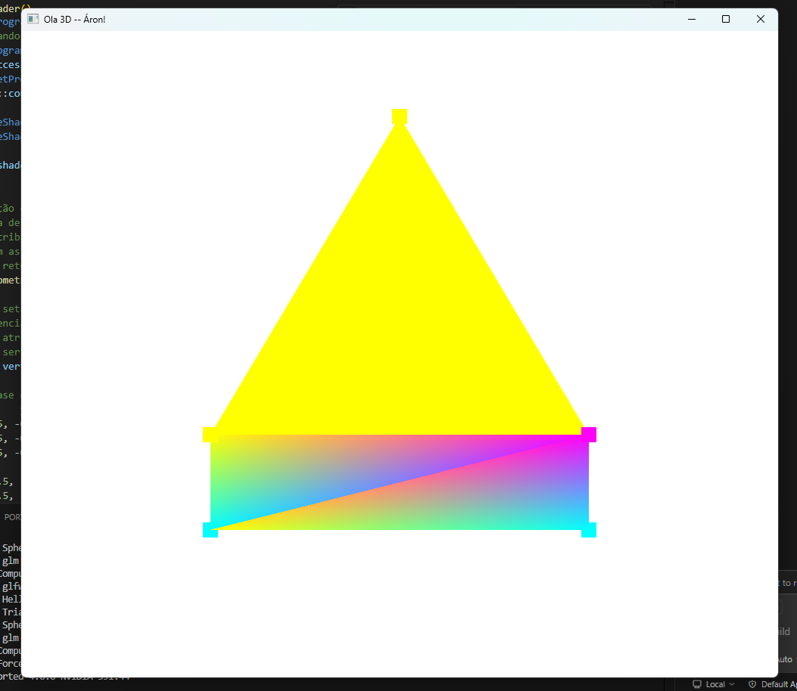

# Desafio 1

# Desafio 2
C:\projeto_java\ComputacaoGrafica\src\Desafio2.cpp

Teclas Rotação: ZXY
Teclas Translação: WASD
Teclas Diminuir/Aumentar: -/= 

# Vivencial 1
C:\projeto_java\ComputacaoGrafica\src\Vivencial1.cpp

Teclas Rotação: ZXY
Teclas Translação: WASD
Teclas Diminuir/Aumentar: -/= 
Teclas Seleção Objeto: 1 e 2